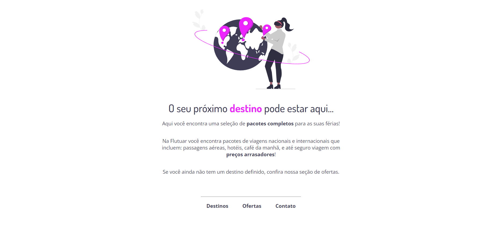

<h1 align="center">Recap concepts HTML & CSS</h1>

[Projeto](#projeto)
&nbsp;&nbsp;&nbsp;|&nbsp;&nbsp;&nbsp;
[Tecnologias](#tecnologias)
&nbsp;&nbsp;&nbsp;|&nbsp;&nbsp;&nbsp;
[Layout](#layout)
&nbsp;&nbsp;&nbsp;|&nbsp;&nbsp;&nbsp;
[Licença](#license)

  

 

 
 

## 💻 Projeto 

Esse projeto é mais um dos que o Explorer, curso da Rocketseat recebeu de atualização e estou enviando apenas para completar o Stage 2, embora já estivesse completo.

Ficou faltando a imagem do footer, mas notei com daria trabalho para reajustar aquele svg em grande telas, então optei por retirar ela.

 
 

## 🚀 Tecnologias 

- HTML
- CSS

 
 

## 🔖 Layout 

Você pode visualizar o layout do projeto através [DESSE LINK](https://www.figma.com/file/waisYRoNzeBgIxOyrz0b2R/Projeto01-Extra/duplicate). É necessário ter conta no [Figma](https://figma.com) para acessá-lo.

 
 

## 🔒 Licença

Esse projeto está sob a licença MIT.

